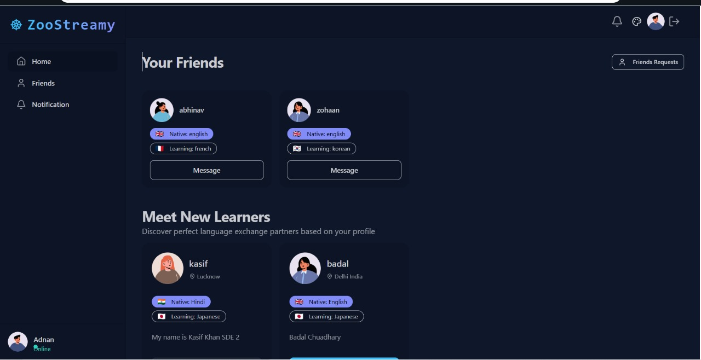

# 🦓 ZooStreamify

ZooStreamify is a **production-grade, real-time communication platform** engineered using the **MERN stack**.  
It enables seamless online collaboration through **video calling, real-time chat, screen sharing, and session recording**, with a strong emphasis on **security, scalability, and user experience**.

Designed with modern backend architecture and real-time systems in mind, ZooStreamify demonstrates the ability to build **end-to-end, scalable, and secure web applications**.

---

## 🚀 Product Overview

ZooStreamify allows users to:
- Communicate in real time
- Collaborate using video and screen sharing
- Record sessions for future reference
- Manage connections through a friend system
- Experience a responsive, modern UI across devices

---

## ✨ Key Features

### 🔐 Secure Authentication & Authorization
- JWT-based authentication
- Protected private routes
- User-specific access control

### 💬 Real-Time Messaging
- One-to-one chat using WebSockets
- Instant message delivery and notifications
- Persistent chat history

### 📹 Video Calling & Screen Sharing
- Peer-to-peer video calls
- Real-time screen sharing for collaboration

### 🎥 Session Recording
- Record video calls or lectures
- Store and replay recorded sessions

### 👥 Social & Presence System
- Send and accept friend requests
- Online/offline user presence tracking

### 🔔 Real-Time Notifications
- Instant updates for messages and friend requests

### 📱 Responsive UI
- Optimized for desktop, tablet, and mobile devices
- Clean and intuitive user experience

---

## 📸 Application Preview



> 📌 Place `Zoostream.jpg` in the root directory of the project.

---

## 🧠 System Architecture

```text
Client (React + Tailwind)
        |
        |  REST APIs / WebSockets
        |
Backend (Node.js + Express)
        |
        |  MongoDB (Users, Chats, Friends)
        |
Socket.io (Real-time Events)

**Architecture Highlights**
- **Frontend** manages UI state and real-time interactions  
- **Backend** handles authentication, APIs, and business logic  
- **Socket.io** powers real-time messaging, calls, and notifications  
- **MongoDB** provides persistent and scalable data storage  

---

## 🛠️ Technology Stack

### Frontend
- React
- Tailwind CSS
- React Router

### Backend
- Node.js
- Express.js
- MongoDB (Mongoose)

### Real-Time Communication
- Socket.io

### Authentication
- JWT (JSON Web Tokens)

### Deployment
- Backend: Render  
- Frontend: Netlify / Vercel  

---

## 📡 API Design (Sample)

### 🔑 Authentication
**POST** `/api/auth/register`  
Registers a new user and securely stores credentials.

**POST** `/api/auth/login`  
Authenticates the user and returns a signed JWT.

---

### 👤 Users
**GET** `/api/users/me`  
Fetch authenticated user profile *(Protected)*

**GET** `/api/users/friends`  
Retrieve friend list along with presence status

---

### 💬 Chats
**GET** `/api/chats/:userId`  
Fetch chat history between two users

---


## 🏗️ Installation & Local Setup

### 1️⃣ Clone the Repository
```bash
git clone https://github.com/Kasif17/ZooStreamify.git
cd ZooStreamify
